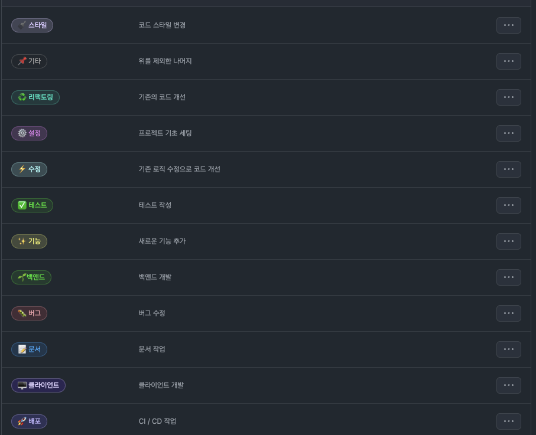

# 💡 Giuhub Convention

# 📌 Git Commit

## 🤙🏼 기능별로 최대한 쪼개어 짜기

### type

```
feat: 새로운 기능을 추가
fix: 버그 수정 또는 기능에 대한 큰 변화와 결과에 변화가 있을 때
docs: 문서 관련 커밋
refactor: 기능에 대한 변화 없이 리팩토링
style: 코드 스타일 변경(formatting, missing semi colons, …)
test: 테스트 관련 커밋
chore: 기타 커밋
design: CSS 등 사용자 UI 디자인 변경
setting: 프로젝트 기초 세팅 시
deploy: CI / CD 작업 시
```

in-progress

```
type(Package) : #이슈 - 커밋 내용 최대 50자

커밋 설명

Related to: #이슈
```

- done

```
type(Package) : 커밋 내용 최대 50자

커밋 설명

Closes: #이슈
```

# 📌 Github Issue

```
[type]: 이슈제목

ex) [feat] 로그인 UI 구현
```
## Label



# 📌 Git Branch

## 🤙🏼 쉽게 되돌릴 수 있도록 기능은 세분화하기!


git-flow 정책 ([https://techblog.woowahan.com/2553/](https://techblog.woowahan.com/2553/))

### 1. branch 종류

- 서비스 출시 : master, main
- 개발 : develop
- **기능 개발 : feature**
- 다음 서비스 : release
- 출시 후 버그 수정 : hotfix

### 2. feature branch 명

```
front : feature/기능 설명
back : feature/기능 설명
```

### 3. git branch 관련 명령어

✨현재 자기 위치(폴더&브랜치) 확인 하기

- 브랜치 목록 : `git branch`
- 브랜치 생성 후 리모트: `git checkout -b "브랜치 명"`
- 브랜치 삭제 : `git branch -d "브랜치 명"`
- 브랜치 이동 : `git switch "브랜치 명" (checkout은 위험성이 커서 switch 권장)`
- 브랜치 이름 변경 : `git branch -m "바꿀 브랜치 명" (바꿀 브랜치에서)`

# 📌 Git PR **requests**

## 🤙🏼 코드 리뷰 1개 이상하기
🤙🏼 comment 꼭 하기 + 이모티콘
🤙🏼 merge는 꼭 본인만!!
🤙🏼 Label 설정 꼭 하기